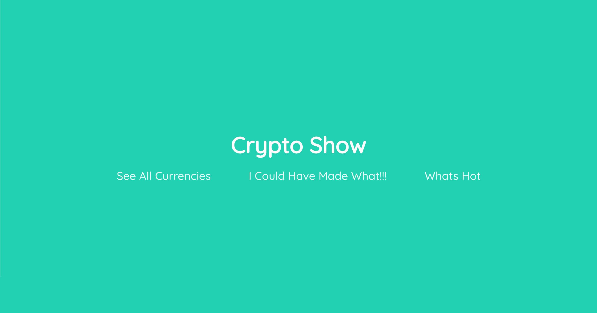
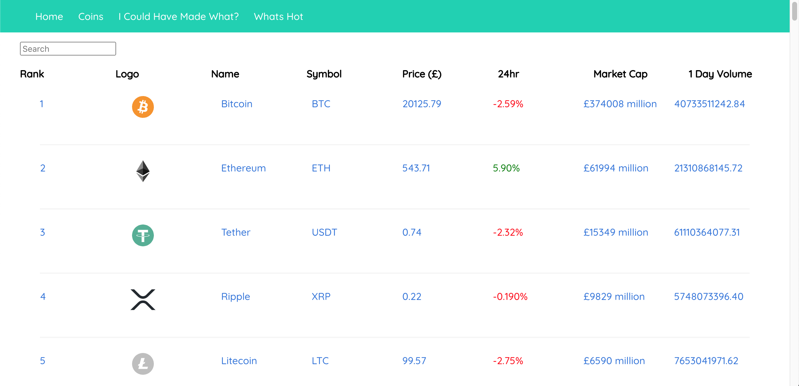
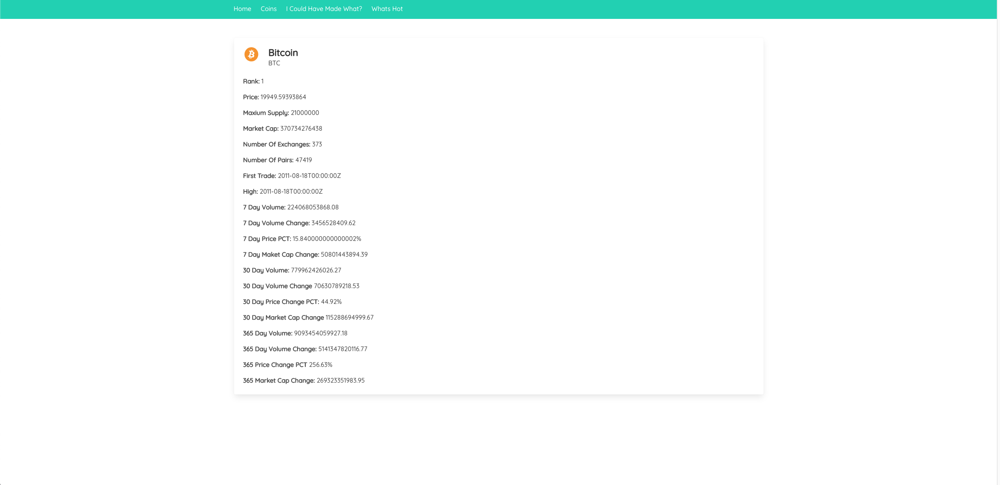
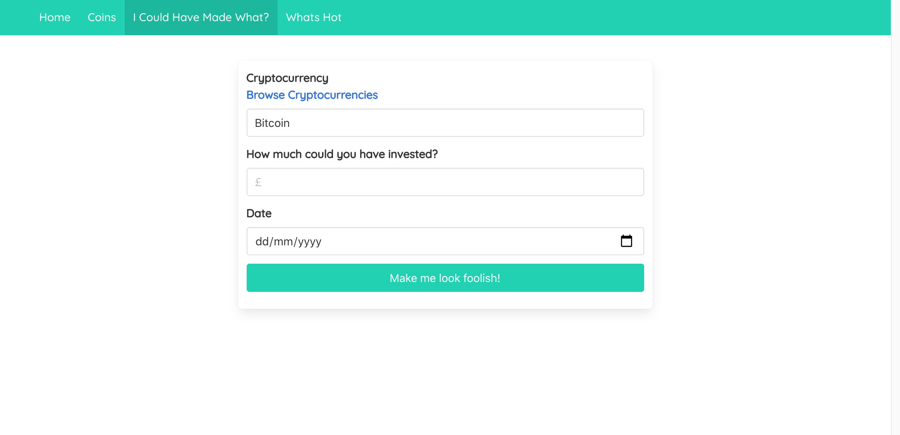
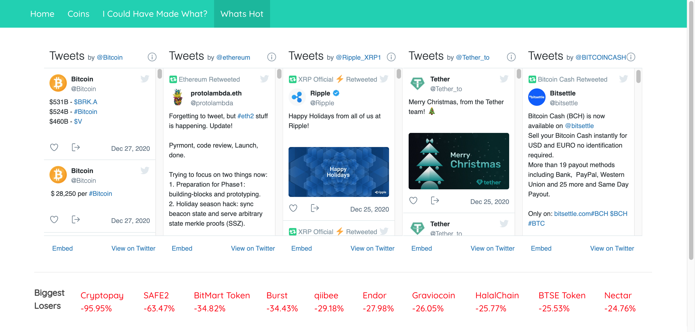
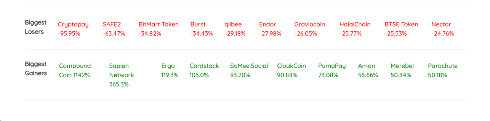
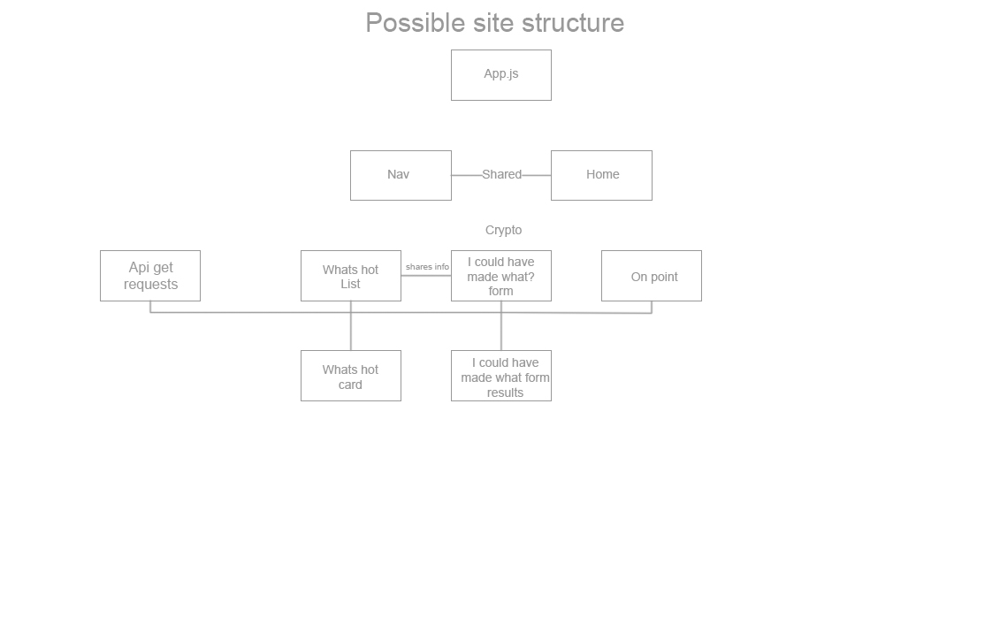
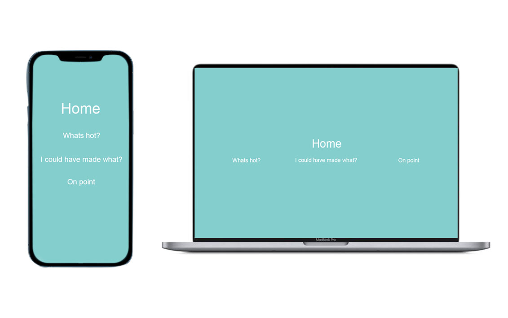
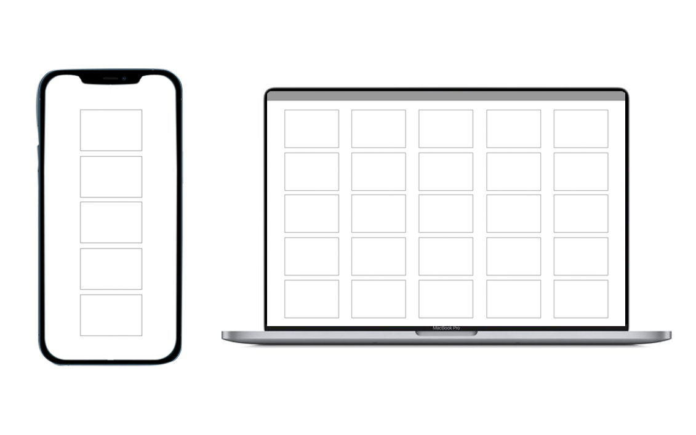

<h1>SEI-Project Two: Reactathon</h1>

<h2>Project Brief</h2>

This was the second project I completed in General Assembly’s Immersive Software Engineering course. Project two was pair project, where my pair and I were tasked with building a functional React Application that consumed a public API in a 48 hour time period. 

<h2>Technologies used</h2>
<ul>
<li>React JS</li>
<li>JavaScript</li>
<li>Axios</li>
<li>Bulma</li>
<li>Insomnia</li>
<li>Sass</li>
<li>Github</li>
<li>Netlify</li>
<li>Nomics Public API</li>
<li>VS Code Live Share</li>
</ul>

<h2>The App: Crypto Show</h2>

<h3>App Overview</h3>

Crypto Show is a single page React Application with multiple components. The app consumes Nomics Public API and mounts the data back to the app. Where it is rendered in an interactive way for the user.

You can find a live version of the app here: [Crypto Show](https://cryptoshow.netlify.app/)

<h3>How to use the App</h3>

<ol>
<li>When a user first logs onto the app they are taken to the home page. On the home page the Nav Bar is hidden and user can select one of three links below the heading.</li>

#   

<li>If a user clicks, ‘See All Currencies’ they are taken to the page that corresponds to ‘coins’ in the Nav Bar. This page lists all the crypto currencies in the Nomics API. A user can search for a currency by name or scroll through the currencies page by page. The page is restricted to 100 results per page number. A user can click on a currency and will be taken to another page that displays more in depth historical data about that currency.</li>

#  

#  

<li>If a user clicks ‘I Could Have Made What!!!’ they are taken to the page that corresponds too ‘I Could Have Made What’ In the Nav Bar’. On this page a user can find out how much money they could have made from investing with either Bitcoin or Ethereum at a specific time.</li>

#  

<li>Lastly if a user clicks ‘Whats Hot’ this corresponds to ‘Whats Hot’ in the Nav Bar a user is taken to the ‘Whats Hot’ page. At the top of the page are the embedded twitter profiles of the top 5 ranked crypto currencies on the Nomics API. Underneath that are the top ten biggest gainers and losers of the day. That are updated automatically every 10 seconds.</li>

#  

#  

</ol>

<h2>Creating The App</h2>

Once we had a solid idea on the type of App we wanted to build we mapped out a rough visual representation of what pages the app should contain and look like using wireframes.

#  

#  

#  

#  

<h3>Home Page, Nav Bar and Site Structure</h3>

We began the project by creating the site structure this meant creating all the components that would be used in the app. Each component had a basic function that returned its name so we could tell each component was displaying correctly. Once all components we created they we grouped into folders and imported to App.js. For the site navigation we used ‘React Router DOM’. Once the Nav Bar was created and all the components were linked we moved on to the homepage. To stick to a clean modern design we chose to hide the Nav Bar on the home page and display the three main components of the app underneath the title.

<h3>Coins / All Currencies Page</h3>

The first interactive component we created was the coins page. We started by making an API request to the Nomic API. We used Axios to make the GET request. Once testing the app was receiving the data we mapped over the data to create a table of results. The coin page consisted of one component. The ‘CoinIndex’ that held the Nav Bar and the headings for each category in the table. Each time an object was mapped over it would create a new ‘CoinCard’ component for each currency. ‘CoinCard’ was a child component of the ‘CoinIndex’ .

 
At this point we realised we were only able to request 100 results at a time. To overcome this problem we added a function that would display page numbers at the bottom of the page. A user would start on page one. When a user clicked page 2, a new GET request was made for the next 100 results. Then we added a search function that allowed a user to search for a currency by name.

 
Lastly we added a link to each ‘CoinCard’, the link would take a user to a new component called ‘CoinShow’. ‘CoinShow’ would make another GET request to Nomics but this time it would use the id of a crypto currency from the request made on the ‘CoinIndex’ page retrieve the data for the crypto currency that had been clicked. The data was then laid out on the page allowing a user to see more detailed historical data on the given currency.

<h3>I Could Have Made What?</h3>

For this page we made a form that would capture a users data. Once we tested we were capturing the user data correctly we made another function that would take the user data and convert it to the correct form required by the Nomics API to make a historical data GET request. If data was received back from the Nomics API it would be passed into state and and a conditional statement would be used to render a result underneath the form.

<h3>Whats Hot?</h3>

We first started by researching how we could embed the twitter profiles of the top 5 ranked crypto currencies on the page and found that an NPM package called ‘React Twitter Embed’ was the best way to do this. Then we made a new function that used the same GET request we had used on the ‘CoinIndex’ page. We took the data and made a new function that compared all the 1 day price changes and pushed them into an array. It then took the top to prices from that array and sliced it into another array and took the bottom 10 prices and sliced those into another array. The results were then displayed back to page. We the added a setTimeOut to the get request so the data on the page would refresh every 10 seconds.

<h2>Challenges</h2>

We ran into a few challenges while building the Crypto Show App. The two biggest challenges would have were, firstly was coverting the data captured from a user into a format that the Nomics API would accept. Secondly would have been some of the object keys used in the Nomics API had irregular naming conventions that conflicted with JavaScript like having a numeral in at the start of a key name. It took a while to find a work around for this.

<h3>Wins</h3>

The biggest win for me was we started off we a clear idea in mind and a pretty solid plan and I feel we achieved pretty close to our original idea/plan. We did have to make a few comprises after finding out that working with a public API was not as straight forward as we initially thought.

<h3>Future Features</h3>
<ul>
<li>Update 'I Could Have What!!' page to search for more than two currencies</li>
<li>Add more content to the 'Whats Hot? page</li>
 </ul>